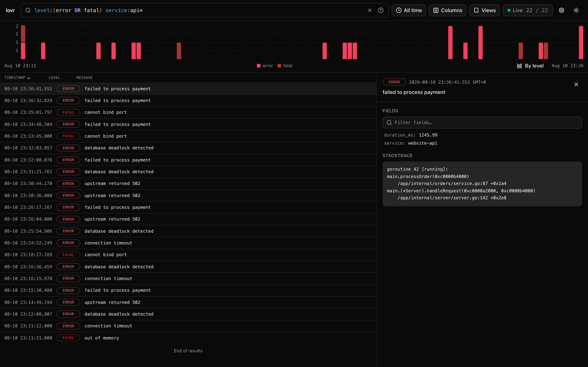

# lovr: LOgVieweR

LOgVieweR is a tool that enable you to view your logs in a human readable way —
as pretty-printed entries in the terminal, or through a built-in
[web UI](#web-ui) with live tail, search, histogram and saved views.



### Example:

Input:
```
{"level":"info","ts":1648174276.8416204,"caller":"api/main.go:45","msg":"connecting to redis","service":"website-api","version":"dev","build":"local","build_date":"20220308","go_version":"go1.16.5","addresses":["redis:6379"]}
{"level":"info","ts":1648174276.8429966,"caller":"zapreporter/reporter.go:28","msg":"starting service","service":"website-api","version":"dev","build":"local","build_date":"20220308","go_version":"go1.16.5","dependency.service":"HTTP Server"}
```

Output
```
     Level: Info
   Message: connecting to redis
 Timestamp: 2022-03-24 23:11:16.841620445 -03:00
    Fields:
      ├─ service   : website-api
      ├─ version   : dev
      ├─ build     : local
      ├─ build_date: 20220308
      ├─ go_version: go1.16.5
      └─ addresses : [redis:6379]
    Caller: api/main.go:45
----------------------------------------
     Level: Info
   Message: starting service
 Timestamp: 2022-03-24 23:11:16.842996597 -03:00
    Fields:
      ├─ service           : website-api:wq
      ├─ version           : dev
      ├─ build             : local
      ├─ build_date        : 20220308
      ├─ go_version        : go1.16.5
      └─ dependency.service: HTTP Server
    Caller: zapreporter/reporter.go:28
----------------------------------------
EOF
```

### Installation

Download a prebuilt binary (with the web UI embedded) from the
[releases page](https://github.com/jamillosantos/lovr/releases).

Or build from source (requires Go and [bun](https://bun.sh)):

```
git clone https://github.com/jamillosantos/lovr
cd lovr && make install
```

> `go install github.com/jamillosantos/lovr/lovr@latest` still works, but the
> resulting binary will not include the web UI (the built assets are not
> committed to the repository), so `lovr web` will serve the API only.

### Usage

Below some examples of how you can use the `lovr`:

#### Loading from a file:

For this case, imagine you have a log file called `app.log`.

```
lovr -s app.log
```

#### Listening changes in a file:

For this case, you have a process running adding logs to a `app.log`.

```
tail -f app.log | lovr
```

#### Filtering entries

The `--filter` (`-f`) option only outputs entries matching a query, using the
exact same [search syntax](#search-syntax) as the web UI:

```
lovr --filter 'debug_id:75fcd5f5-f04d-4dc7-9be3-e2e574857a76' -s app.log
# Only errors and fatals from the api services, skipping the health check:
lovr -f 'level:(error OR fatal) service:api* -route:/health' -s app.log
# Entries mentioning "timeout" anywhere that carry a user_id field:
lovr -f 'timeout _exists_:user_id' -s app.log
```


#### Loading from the STDIN:

For this case, you will run your application and its STDOUT will be redirected straight
to the `lovr`. As long `yourapp` is running, `lovr` will be active converting the output.

```
./yourapp | lovr
```

#### Loading from the STDERR:

The same as above. However, in this case, instead of capturing the STDOUT, we are capturing
the STDERR.

```
./yourapp 2>&1 >/dev/null | lovr
```

#### Loading from a docker container:

In this case, we will be capturing the output of docker container. The `docker logs`
will output all the logs it has until this moment, then it will close. `lovr` will
also close when it happens.

```
docker logs c353a06afee4 | lovr
```

If you want to keep `lovr` running just add the `-f` option to the `docker logs` 
command.

```
docker logs -f c353a06afee4 2>&1 | lovr
```

#### Loading from a docker-compose container:

In this case, we will be capturing the output of docker-compose container. The 
`docker-compose logs` will output all the logs it has until this moment, then it
will close. `lovr` will also close when it happens.

```
docker-compose logs --no-log-prefix api | lovr
```

If you want to keep `lovr` running just add the `-f` option to the `docker-compose logs`
command.

```
docker-compose logs -f --no-log-prefix api | lovr
```

### Search syntax

The web UI search bar and the `--filter` option share the same query language.
All terms must match (AND) unless combined with `OR`:

| Example                     | Meaning                              |
| --------------------------- | ------------------------------------ |
| `error timeout`             | all terms must match (AND)           |
| `level:error`               | match a field                        |
| `nested.host:db1`           | nested fields use dots               |
| `message:"failed to process"` | exact phrase                       |
| `-level:debug`              | exclude matches                      |
| `status:>499`               | numeric ranges (`>`, `>=`, `<`, `<=`)|
| `message:*onnect*`          | wildcards match inside words         |
| `_exists_:user_id`          | entries having a key (alias for `user_id:*`) |
| `level:error OR level:fatal`| `OR` combines alternatives (uppercase)       |
| `(level:error OR level:fatal) service:billing` | parentheses group for precedence |
| `level:(error OR fatal)`    | value lists match any item ("in"); items can be quoted |

Well-known source keys are normalized before matching: `msg` becomes
`message`, and `ts`, `time`, `@timestamp`, `date` or `datetime` become
`timestamp`. The web UI documents all of this in the `?` popover next to the
search bar, and autocompletes field names and values as you type.

### Web UI

The `web` command does everything the default command does and additionally
indexes every entry into an in-memory search index
([bleve](https://github.com/blevesearch/bleve)), exposing a web UI:

```
./yourapp | lovr web
```

Then open http://127.0.0.1:8080 (change with `--bindaddr`/`-b`).

- **Live tail** over a websocket, with pause/resume, follow mode and
  infinite scroll through the history.
- **Search** with the [syntax above](#search-syntax): highlighted as you
  type, autocomplete with per-value counts, persisted in the URL.
- **Histogram** of matching entries, grouped by level or any field; drag a
  region to zoom the time range.
- **Time range filter** with quick presets and a calendar.
- **Saved views** capturing the query, time range, columns and their widths,
  sort order and chart grouping — with one-click update of the active view.
- **Quick field actions**: click any key/value to copy it or add/exclude it
  from the search.
- **Resizable** columns and detail panel; sortable timestamp column.
- **Settings** (stored in the browser): timezone, theme, 12/24h clock,
  density, level aliases, chart behavior and more — exportable to JSON.

The UI (bun + React + Tailwind) lives in `ui/` and is embedded into the
binary at compile time:

```
make build
```

or manually:

```
go generate ./ui
go build -o lovr-bin ./lovr
```

Binaries built without the UI assets present (e.g. a plain `go build` on a
fresh checkout) still serve the HTTP/websocket API, only without the web
page. For UI development, run the backend and the bun dev server side by
side:

```
./yourapp | go run ./lovr web                     # API at 127.0.0.1:8080
cd ui && BUN_PUBLIC_API_URL=http://127.0.0.1:8080 bun dev
```
